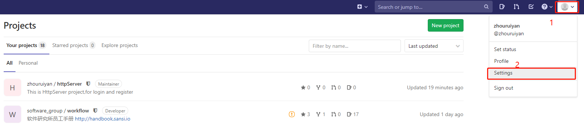
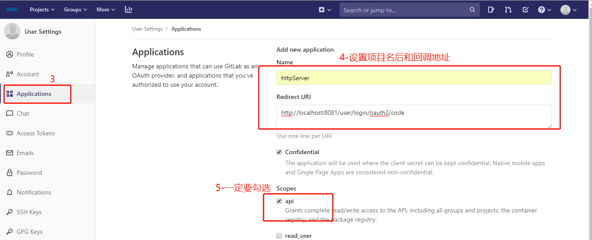
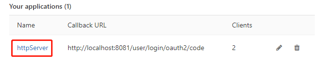
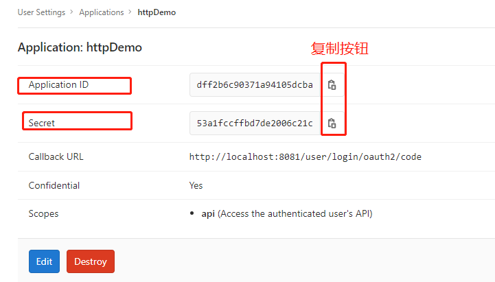

## HttpServer项目部署启动流程

1. npm i

2. node server   (项目启动)

3. 浏览器输入 http://localhost:8081/进行访问

   ##### tips:如果想测试GitLab登录接口需要以下操作

   1. 打开自己的GitLab网站，进行配置Oauth,并且保存----图中有save application按钮，未截到图

      

      
   
   ​		Redirect URI:http://localhost:8081/user/login/oauth2/code
   
   2. 仍然在Applications的页面，最下面会有一个连接，点开将会看到下面的clientId和clientSecurt
   
      
   
      ​		
   
      3. 打开下载的项目，修改config/gitLabConfig.json文件中的值：
   
         git_clientId字段值为上图中的ApplicationID值,
   
         git_clientSecret字段值为上图中的 Secret 值，
   
         重新启动项目，就可以测试GitLab登录接口