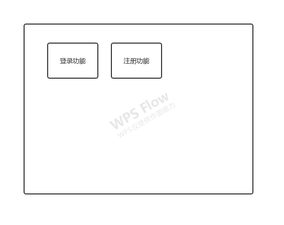
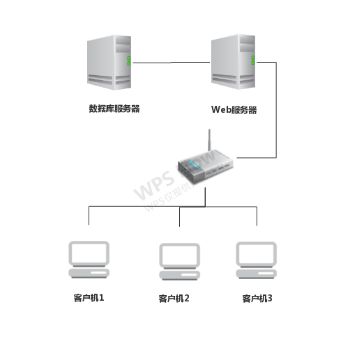
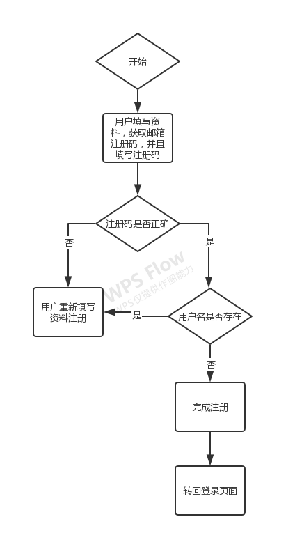
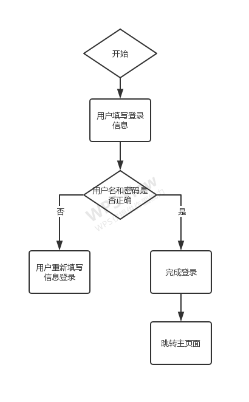

# HttpServer方案设计文档

##  1.目标

​		在满足用户体验的前提下，实现用户登录、注册功能。

## 2.预想结果

​		预想结果如下：

  		1. 在注册页面完成注册，并且跳转登录界面；
       * 注册页面需要填写并验证邮箱，防止恶意注册
       * 注册用户名必须唯一
        		2. 在登录页面完成登录，并且跳转主页面；
        		3. 当访问页面时，如果用户已经完成登录，则直接进入主页面，未登录直接显示登录页面。

## 3.开发规划

### 3.1开发人员

周瑞彦  软件研究所_3组  软件工程师

### 3.2开发计划

| 日期              | 输出                       | 描述          |
| ----------------- | -------------------------- | ------------- |
| 20200326-20200327 | 查询资料产生大体规划       |               |
| 20200330          | 《httpServer方案设计文档》 | 将文档提交git |
| 20200401-20200402 | 代码实现                   | 将代码提交git |

### 3.3开发环境和工具

| 工具及语言                                            | 描述         |
| ----------------------------------------------------- | ------------ |
| VsCode                                                | 编写代码工具 |
| Nodejs_v12.16.1+express+sqlite3+html+css+JavaScript等 | 编程语言     |
| Sqlite数据库                                          | 用于存储数据 |

### 3.4开发规范

命名满足见名知意

代码添加有效注释

满足公司开发规范等

## 4.总体设计

### 4.1基本设计描述

在公司现有的条件下，实现系统部署。（暂不支持外网访问）

#### 4.1.1系统总体逻辑结构图

#### 4.1.2系统部署结构图

### 4.2主要界面流程描述

#### 4.2.1注册界面流程

#### 4.2.2登录界面流程

## 5.数据结构

​		为了满足数据库设计的三范式，则数据库表设计如下：

user_info(用户信息表)

| 字段名       | 是否必填 | 中文描述 | 备注 |
| ------------ | -------- | -------- | ---- |
| Id           | Y        | Id值     |      |
| user_name    | Y        | 用户名   |      |
| user_mobile  | N        | 手机号   |      |
| user_email   | Y        | 邮箱     |      |
| user_address | N        | 地址     |      |

user_login(用户登录表)

| 字段名     | 是否必填 | 中文描述 | 备注                |
| ---------- | -------- | -------- | ------------------- |
| Id         | Y        | Id值     | 此Id与user_info关联 |
| login_name | Y        | 登录名   |                     |
| password   | Y        | 密码     |                     |

## 6.模块设计

### 6.1注册模块设计

​		此功能用于实现注册功能，用户填写注册的信息，如用户名，密码，邮箱等信息，点击“注册”按钮进行注册。

注意：此功能为了防止恶意注册，攻击服务器，实现了邮箱验证的接口，用户必须将邮箱接收到的验证码正确填写才能完成注册。

#### 6.1.1 模块设计描述

1. 用户必须填写正确的邮箱，并且填写邮箱收到的验证码来完成注册；
2. 注册采用POST请求的方式；
3. 当邮箱验证码不正确或者用户名已存在，则需要用户重新填写信息进行注册；
4. 当信息无误，则将信息入user_info和user_login表，两表之间的数据使用ID字段产生关联；
5. 注册成功则跳转登录页面。

#### 6.1.2模块界面描述

输入：用户填写登录名、用户名、手机号、邮箱、地址字段、验证码字段；

输出：注册成功跳转登录页面。

### 6.2登录模块设计

此功能用于实现登录功能，用于填写登录信息，用户名和密码，点击“登录”按钮进行登录。

#### 6.2.1模块设计描述

1. 用户必须填写正确的用户名和密码来完成登录；
2. 登录采用POST请求的方式；
3. 当用户名或者密码错误，需要用户重新填写信息进行登录；
4. 登录成功，将信息存放在session中，并且跳转主页面。

#### 6.2.2模块界面描述

输入：用户填写登录名、密码字段；

输出：登录成功跳转主页面。

## 7.局限性

以下是后续需要优化的地方：

1. 注册页面打算使用手机号进行注册，但是无免费短信，则暂时使用邮箱接口；
2. 登录页面需要增加一次性验证码填写；